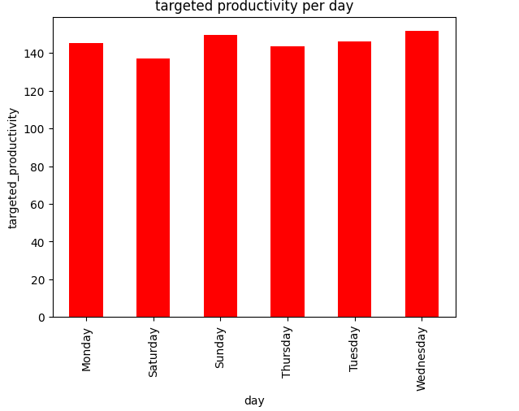

# Determing Actual Productivity
## The project is about determining the actual productivity attainedcompared to the targeted productivity based on the different factors affecting production

**Author**:LAMUNU GLORIA

### Business Problem:
In a garment production facility, target productivity is usually set at a certain number to meet company goals. However, sometimes the actual productivity realised at th
the end of the day or quarter usually differs from the target and can be affected by factors like change in management style, overtime etc

## Data:
date, quarter,department, day, team, targeted_productivity, smv, wip, overtime, incentive, idle_time, idle_men, no_of_style_change, no_of_workers, 
actual_productivity

## Methods
- Importing librariries and data
- Exploring the data and analysing the data using data visualiation techniques like bar graphs, histograms, boxplots
- THe data was split into the training set and the testing set
- The data was preprocessed for modelling. The column quarter was ordinal encoded because it was ordinal in nature. 
- The categorical data was one hot encoded while the numerical part was scaled
- A pipeline of our first model and the preprocessed data was created and all was fit on to the training set
- The linear regression model was used first and it was evaluated using root mean squared error(RMSE), Mean Absolute Error(MAE) and R2 score
- The Random Forest Model was also used and evaluated using RMSE, MAE, R2score
- The random forest model was fine tuned and evaluated again
- The best model was selected

## Results

#### Actual productivity per day

